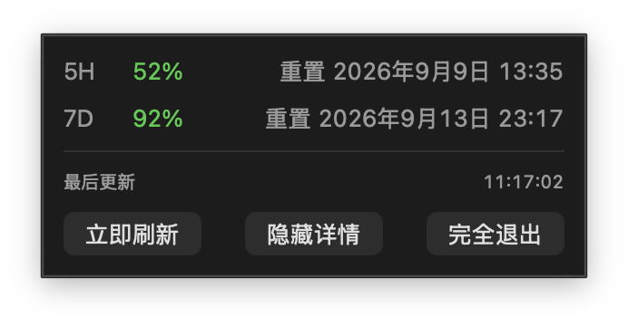

# Codex Quota Badge

[简体中文](README.md) | [English](README.en.md)

A lightweight, safe, local-first macOS menu-bar app for viewing your Codex 5-hour and 7-day quota.

**No network requests · No credential access · Read-only logs · No telemetry**

```text
5H 52%
7D 92%
```



Opening a usage page repeatedly interrupts work. Codex Quota Badge keeps the essential quota information in the menu bar, with reset times and last-update time available on click.

> This is currently a development preview. The repository supports running from source. A Developer ID-signed and Apple-notarized installer will be provided for the first public release.

## Run and install

### Run from source

Requirements:

- macOS 13 or later;
- Swift 6 command-line tools;
- at least one local Codex session that contains quota data.

Clone the repository, enter its directory, then run:

```bash
bash scripts/run-local.sh
```

The app does not appear in the Dock; it appears in the macOS menu bar. Click the quota area to open details, and choose **Quit** to exit.

You can also build it manually:

```bash
swift build
swift run CodexQuotaBadge
```

### Development preview installer

To generate a local `.app` and `.dmg` preview:

```bash
bash scripts/create-preview-dmg.sh
```

The artifacts are placed in `dist/`. They use ad-hoc signing for local preview only and are **not Apple-notarized**. Gatekeeper will treat them as untrusted, so do not distribute this preview package. Public downloadable releases will use Developer ID signing and Apple notarization.

## Features

- Compact two-line menu-bar display for 5-hour and 7-day remaining quota.
- Reset times and last-update time in the detail panel.
- **Refresh now**, **Hide details**, and **Quit** controls.
- Borderless, draggable detail panel.
- A calm **No quota detected** state when no usable log exists; the app does not crash.
- Keeps the most recent valid snapshot when a log is temporarily unreadable or has an incomplete final line.
- Works fully offline and does not use an OpenAI API or third-party server.

## Security and privacy

| Behavior | Does the app do it? |
| --- | --- |
| Read local Codex session logs | Yes, only to locate quota fields |
| Save or upload conversation content | No |
| Modify or delete Codex files | No |
| Read browser cookies | No |
| Read passwords, tokens, or API keys | No |
| Send requests to OpenAI or third parties | No |
| Upload usage records or telemetry | No |
| Store a quota-history database | No |
| Automate account actions | No |

The app opens local Codex session logs only to locate existing quota snapshots such as `payload.rate_limits`. It does not save the conversation body elsewhere, upload it, or send it to another process. Processing happens on the current Mac, and the in-memory snapshot is released when the app quits.

Here, “safe” means minimal permissions, local read-only operation, no network transfer, and no interference with Codex. No software should promise absolute zero risk; inspect the source before running it if local log access is a concern.

## Why it is lightweight

At startup, the app finds the newest valid quota log in `~/.codex/sessions` and keeps only these values in memory:

- the current log path;
- its modification time;
- the latest valid quota snapshot.

On each one-minute refresh:

1. If the tracked log is unchanged, the in-memory snapshot is reused without reopening or reparsing it.
2. If it changed, only that file is parsed again.
3. If a new session appears, the file is deleted, or the directory changes, the app discovers a valid log again.

macOS filesystem events mark that rediscovery is needed. They do not create a continual directory-polling loop or repeated scans when events arrive.

```text
Local Codex logs
       ↓ initial discovery
Cached path, modification time, and quota snapshot
       ↓ one-minute status check
 ├─ unchanged → reuse in-memory snapshot
 ├─ changed   → parse only the tracked file
 └─ new session / deletion → rediscover a valid log
       ↓
Menu bar shows remaining 5H / 7D quota
```

## Local performance measurement

This is one reproducible idle measurement on the development machine, not a fixed result for every Mac:

| Condition | Result |
| --- | --- |
| Hardware | Apple Silicon, macOS 26.6.2 |
| Build | Release build with fixed preview data |
| CPU | `0.0%` in two samples, ten seconds apart |
| Resident memory (RSS) | about `56.8 MiB` in both samples |
| Binary minimum macOS version | macOS 13.0 |

Per-system-call filesystem tracing requires administrator privileges on macOS, so it is not represented as measured data. What is verified by implementation and automated tests is that unchanged logs reuse memory rather than being reopened or reparsed; the app also has no periodic writes, database, or quota-history file.

See the [performance methodology](docs/PERFORMANCE.md) for details and limits.

## FAQ

### Why does it say “No quota detected”?

You may not have a local Codex session containing quota data yet. The app will not ask you to sign in or fall back to browser or account credentials.

### Must ChatGPT or Codex remain open?

No. The app can continue showing the latest valid snapshot after Codex is closed. Values update only after Codex writes a new local quota snapshot.

### Why can the value differ from the web page?

The app reads the most recently written local log snapshot, not a public official API. It can temporarily lag behind the web UI.

### What if a Codex update changes the log format?

Local log format is an implementation detail and may change. Please open an issue with a minimal, redacted sample; never upload a full session log.

### How do I quit or uninstall it?

Choose **Quit** in the detail panel. The source version installs no login item, background service, or quota-history database; remove the cloned project directory to remove the source and build artifacts.

### Why is the menu-bar item missing?

First confirm that the app is still running. A crowded macOS menu bar or a third-party menu-bar manager can also hide items.

## Tests

```bash
swift run CodexQuotaBadgeTestRunner
```

Tests cover quota-window recognition, remaining percentage, desktop-log format, incomplete final lines, menu-bar text, local-time display, refresh decisions, and cache reuse.

## Current limitations

- macOS only, currently distributed from source;
- quota comes from local Codex logs, so parser updates may be needed if their format changes;
- no sign-in, account switching, credit purchase, notifications, or automatic updates;
- tested on Apple Silicon; Intel Macs have not yet been manually verified;
- release-build CPU/RSS measurement is documented, but this project does not publish estimated disk metrics as measured facts.

## Project structure

```text
Sources/CodexQuotaBadge/          macOS menu-bar UI
Sources/CodexQuotaBadgeCore/      log parsing, cache, and quota state
Tests/CodexQuotaBadgeTestRunner/  test runner and redacted log fixtures
assets/screenshots/               README images
scripts/                          local run, preview, and package scripts
docs/                             design, plans, performance, and status
```

## Contributing

Issues and pull requests are welcome, especially for:

- compatibility with new Codex log formats;
- stronger edge-case tests;
- macOS accessibility and menu-bar improvements;
- app packaging, signing, and release workflows.

Do not attach raw logs containing private conversation content, real file paths, account information, or complete sessions.

## License

This project is licensed under the [MIT License](LICENSE). You may use, copy, modify, and distribute it, including for commercial use, provided that the copyright and license notice are retained.

## Disclaimer

This is an unofficial community tool and is not affiliated with or endorsed by OpenAI. Codex, ChatGPT, and OpenAI are trademarks of their respective owners. The app relies on local implementation details that may change in a future OpenAI update.
