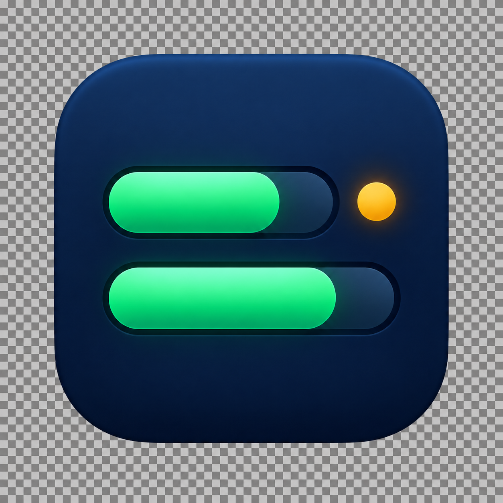

# Codex Quota Badge

[简体中文](README.md) | [English](README.en.md)

一个安静、轻量的 macOS 菜单栏工具，随时查看 Codex 的 5 小时与 7 天剩余配额。

**本地只读 · 不读取凭据 · 不联网 · 无遥测**

<p align="center">
  
</p>

```text
5H 52%
7D 92%
```

点击菜单栏配额即可查看重置时间和最后更新时间：


Codex Quota Badge 专注做好一件事：把最常查看的配额信息放在菜单栏，减少反复打开用量页面带来的打断。

> 当前为开源预览版。正式公开下载前，安装包仍使用本地临时签名，尚未经过 Apple 公证；不同 Mac 的安全提示可能不同。

## 功能

- 双行紧凑显示 `5H` 和 `7D` 剩余配额；
- 点击查看两个周期的重置时间和最后更新时间；
- 提供“立即刷新”“隐藏详情”和“完全退出”；
- 详情窗口无标题栏，可从按钮之外的区域拖动；
- 未找到可用配额时显示“未检测到配额”，不会因此崩溃；
- 日志暂时不可读或末行不完整时，保留最近一次有效快照；
- 原生 macOS 应用图标，不占用 Dock。

## 安装与运行

### 使用安装包

公开版本发布后，可从 [GitHub Releases](../../releases/latest) 下载 `.dmg`。打开后，将应用拖入“应用程序”文件夹即可。

当前本地预览包使用临时签名，仅适合开发者在自己的 Mac 上测试，不建议重新分发。如果 macOS 显示安全提示，请先确认下载来源和项目代码，不要为了安装软件而关闭系统安全功能。

### 从源码运行

要求：

- macOS 13 或更高版本；
- Swift 6 命令行工具；
- 至少运行过一次会产生本地配额快照的 Codex 会话。

克隆仓库并进入项目目录后执行：

```bash
bash scripts/run-local.sh
```

也可以手动运行：

```bash
swift build
swift run CodexQuotaBadge
```

生成本机预览用的 `.app` 和 `.dmg`：

```bash
bash scripts/create-preview-dmg.sh
```

产物位于 `dist/`。

## 隐私与安全

本工具只在当前 Mac 上读取 `~/.codex/sessions` 中已有的 Codex 会话日志，用于定位配额快照字段。它不会：

- 读取浏览器 Cookie、账号密码、Token 或 API Key；
- 修改或删除 Codex 日志；
- 保存、上传或转发会话正文；
- 向 OpenAI 或第三方服务器发送网络请求；
- 创建配额历史数据库或上传遥测数据；
- 登录账号、购买额度或执行其他账号操作。

解析会在本机内存中完成。工具退出后，内存中的配额快照随进程释放。

这里的“安全”指最小权限、本地只读、无网络传输和不干预 Codex。任何软件都不应承诺绝对零风险；如果你对本地日志访问有顾虑，建议先审查源码再运行。

提交 Issue 时，请勿上传完整会话日志。只提供最小化、脱敏后的样本，并移除对话内容、真实路径和账号信息。

## 为什么它很轻量

工具不会每分钟反复扫描全部日志：

```text
首次启动 → 定位最近的有效日志并缓存配额快照
                 ↓
每分钟只检查当前文件状态
 ├─ 没有变化 → 直接复用内存快照
 ├─ 文件变化 → 从当前文件尾部按小块读取并解析
 └─ 新会话或文件删除 → 才重新定位日志
```

目录变化由 macOS 文件系统事件通知。工具没有周期性写入、数据库、历史记录或后台网络请求。

开发机 Release 构建的两次空闲采样均为 `0.0%` CPU、约 `56.8 MiB` RSS。这只是特定设备上的短时测量，不代表所有 Mac 的固定结果。测量方法和磁盘边界见 [性能测量说明](docs/PERFORMANCE.md)。

## 常见问题

### 为什么显示“未检测到配额”？

本地可能还没有包含配额快照的 Codex 会话。工具不会要求登录，也不会转而读取浏览器或账号凭据。运行一次 Codex 会话后，可点击“立即刷新”。

### 必须一直打开 ChatGPT 或 Codex 吗？

不需要。关闭后，工具仍可显示最近一次有效快照；只有 Codex 写入新的本地配额数据后，数值才会更新。

### 为什么与网页上的数字略有不同？

工具读取最近一次写入本地日志的快照，并非官方公开的实时配额 API，因此可能暂时落后于网页端。

### Codex 更新后无法识别日志怎么办？

本地日志格式属于实现细节，将来可能改变。请提交 Issue，并附上最小化、脱敏后的格式样本。

### 如何退出或卸载？

点击详情窗口中的“完全退出”。应用不安装登录项、后台服务或配额历史数据库；从“应用程序”文件夹删除应用即可卸载。

### 菜单栏中为什么看不到它？

请先确认应用仍在运行。菜单栏空间不足，或第三方菜单栏管理工具，也可能隐藏菜单栏项目。

## 测试

```bash
swift run CodexQuotaBadgeTestRunner
```

测试覆盖配额周期识别、剩余百分比、桌面日志格式、异常尾行、菜单栏文本、本地时间、缓存复用和刷新决策。

## 当前限制

- 仅支持 macOS 13 或更高版本；
- Apple Silicon 已验证，Intel Mac 尚未进行人工验证；
- 配额来自 Codex 本地日志，日志格式改变时可能需要更新解析器；
- 不包含登录、账号切换、购买额度、通知和自动更新；
- 当前公开版本尚未使用 Developer ID 签名或完成 Apple 公证。

## 项目结构

```text
Sources/CodexQuotaBadge/          macOS 菜单栏界面
Sources/CodexQuotaBadgeCore/      日志解析、缓存与配额状态
Tests/CodexQuotaBadgeTestRunner/  测试执行器与脱敏日志样本
Packaging/                        应用信息与图标
assets/                           README 截图与图标源文件
scripts/                          本地运行、构建与打包脚本
docs/                             设计、计划、性能与项目状态
```

## 参与贡献

欢迎提交 Issue 和 Pull Request，尤其是新版日志兼容、边界情况测试、macOS 可访问性和发布流程改进。

## 许可证

本项目采用 [MIT License](LICENSE)。你可以使用、复制、修改和分发代码，包括用于商业项目，但必须保留原版权和许可证声明。

## 免责声明

这是一个非官方社区项目，与 OpenAI 没有关联，也未获得其背书。Codex、ChatGPT 和 OpenAI 是其各自权利人的商标。本工具依赖本地实现细节，后续更新可能导致功能暂时不可用。
